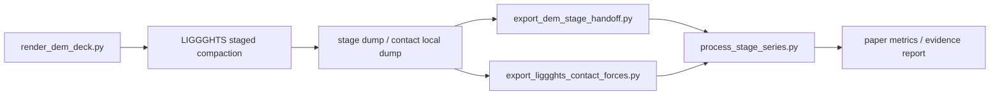

# 02 DEM Backend And Light Demo

## 阶段目的

选择并验证开源 DEM 后端，用真实 DEM 输出替代纯代理数据。当前目的不是论文级
高保真，而是证明可以稳定得到颗粒位置、接触力、压力-密度曲线、力链和拱桥证据。

## 当前决策

| 项目 | 决策 |
|---|---|
| 当前 DEM 后端 | LIGGGHTS-PUBLIC |
| 运行环境 | GitHub Actions ubuntu-22.04 |
| 本地策略 | Windows 负责编辑和检阅，WSL2 后续用于长时间本地运行 |
| 备选 DEM | LAMMPS GRANULAR、YADE、MercuryDPM、Chrono DEME |

## 已完成内容

- `dia60al40-dem.yml` 可以在 GitHub Actions 编译 LIGGGHTS-PUBLIC。
- workflow 能渲染 DEM deck、生成 mesh、运行六个密度阶段。
- 已导出 stage dump、contact local dump、pressure-density curve。
- 已把 LIGGGHTS 直接接触力转换为 `contact_forces/*_contacts.csv`。
- 已用 `process_stage_series.py` 生成四篇论文共用的阶段指标。
- 已有轻量 DEM evidence：`87 pass / 0 missing / 0 mismatch`。

## DEM 数据流

## 验收门槛

| 验收项 | 当前状态 |
|---|---|
| workflow 能从源码构建 DEM 后端 | 通过 |
| 能输出六个阶段的 DEM 数据 | 通过 |
| 能输出 direct contact forces | 通过 |
| 能生成四论文指标和 evidence report | 通过 |
| 能达到论文级粒子数和加载路径 | 未完成 |

## 下一步

本阶段作为基础层保持稳定。后续如果 LIGGGHTS 在高粒子数下不可用，再开启
LAMMPS/YADE/Chrono 替代评估。

