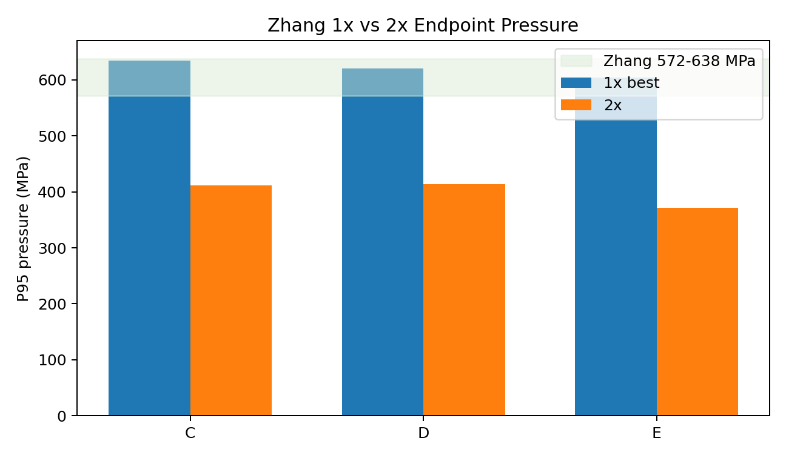
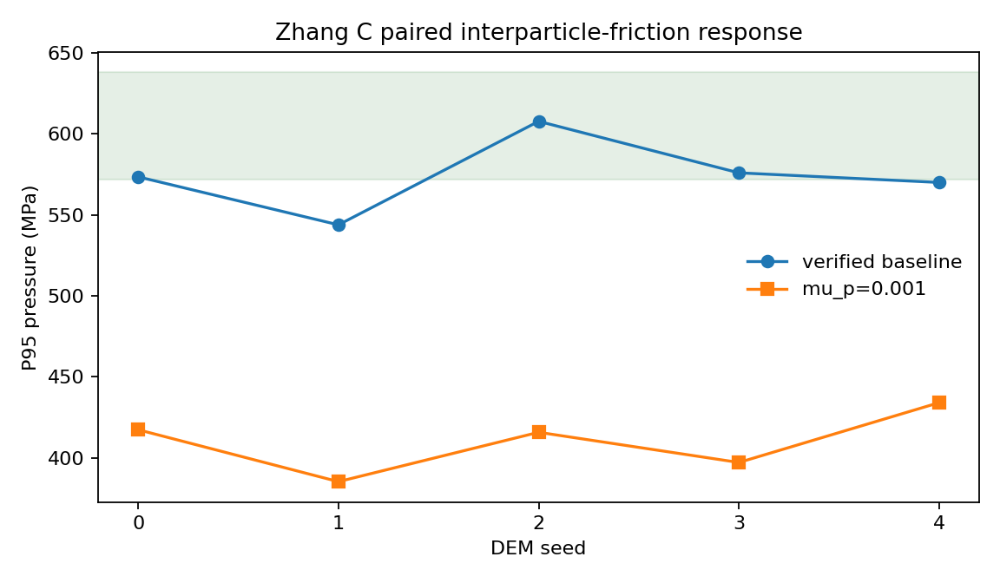
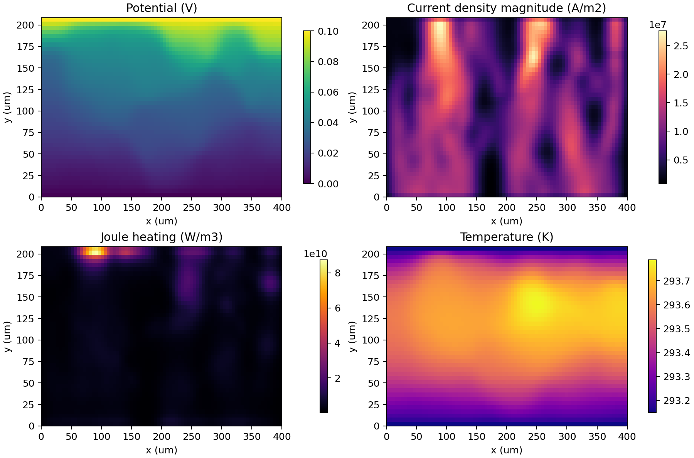

# Stage 03 阶段判读：Zhang 颗粒尺度与力链

## 阶段结论

Stage 03 的 **计算、artifact 导入、代码验证和失败分支排除已经完成**，但论文级
物理标定仍为 `review`。这两个结论并不矛盾：现有证据足以证明 DEM 路线可运行、
可复查，也足以否决若干不合适参数；但 C/D/E 尚未在相同参数体系下同时满足压力、
力链趋势和多随机种子稳健性，因此不能进入 4x/8x，也不能把当前参数称为材料真值。

## 已完成任务及其证据

| 已完成任务 | 主要证据 | 能够说明什么 |
|---|---|---|
| 导入 2x C/D/E 三组 ensemble artifacts | `evidence/run_27875950305/`、`run_27875951506/`、`run_27875952754/` | GitHub 上的真实 LIGGGHTS 计算可被本地重建、汇总和判读 |
| 固定求解器来源 | LIGGGHTS-PUBLIC commit `3d5c00f20519e6bb6eb6756f51f1ad36564e649d` 与各 artifact 的 `solver_provenance.csv` | 后续结果不会因求解器版本漂移而失去可比性 |
| 验证 1x 到 2x 的颗粒尺度敏感性 | `data/1x_vs_2x_comparison.csv`、`figures/p95_1x_vs_2x.png` | 颗粒数翻倍后 C/D/E 的 P95 分别下降 35.06%、33.38%、38.45%，1x 标定不能直接外推 |
| 完成 2x pressure-first 重标定与分 size follow-up | `pscale2_recalibration_report.md`、`pscale2_followup_report.md` | C 可找到单 seed 双门槛候选；D 存在压力与力链趋势冲突；E 需要明显抬升压力 |
| 完成 C 五种子稳健性验证 | `pscale2_c_seed_recheck_report.md` | 原 C 候选仅 1/5 seed 同时通过压力和趋势，单 seed 成功不是稳健标定 |
| 完成 C Emax 抬升验证 | `pscale2_c_pressure_lift_report.md` | 平均 P95 回到 574.211 MPa，CV 降至 0.0396，但双门槛仍只有 2/5 |
| 排除 C dwell、加载速率和低侧壁摩擦分支 | 对应 `pscale2_c_*_report.md` 与配对图 | 这些单变量变化没有同时改善平均压力、方差和力链趋势 |
| 排除 C 极低粒间摩擦 | `pscale2_c_particle_friction_report.md` | 平均 P95 降至 409.996 MPa，说明照搬 Zhang 铁粉最低摩擦点不适用于当前 Al-diamond 简化模型 |
| 完成 E 五种子 pressure-lift 验证 | `pscale2_e_pressure_lift_report.md` | trend 4/5、双门槛 3/5，但平均 P95=644.331 MPa 且不存在共同 Emax 比例窗口 |
| 核验 GitHub artifact 摘要 | `evidence/github_runs.md` 与各 `artifact_verification.json` | 已归档结果与 GitHub artifact digest 一致，重复下载或重跑不会增加证据价值 |

## 当前可保留与必须拒绝的内容

| Size | 当前判定 | 保留内容 | 不能声称的内容 |
|---|---|---|---|
| C | `review` | `Emax=72.581 GPa, mu=0.654` 可作为 2x 压力参考基线 | 不是多 seed 稳健材料参数 |
| D | `review` | `Emax=57.173 GPa, mu=0.770` 是压力窗口候选 | 力链 participation 趋势尚未通过 |
| E | `review` | `Emax=96.417 GPa` 证明抬升压力方向有效 | 平均压力超上限，不能作为稳健候选 |

已经由配对证据拒绝的分支包括：C settle scale 2/4、25 cm/s 加载、
`mu_w=0.001`、`mu_p=0.001`，以及 E 的 Emax-only 继续窄扫。论文中的阻尼系数
`0.2` 缺少方程和单位定义，不能直接映射为 LIGGGHTS 恢复系数。

## 可视化应如何阅读

### 1. 颗粒尺度会改变宏观压力

绿色带是 Zhang 端点窗口。2x 结果整体跌出窗口，直观证明离散尺度改变了接触网络，
因此不能只看求解成功或单一压力值。

### 2. 接触参数会改变承载网络

相同 seeds 下仅改变粒间摩擦，平均 P95 从 574.211 MPa 降至 409.996 MPa。
这说明摩擦和接触状态确实控制力的传递路径，但该图仍是力学证据，不是电热证据。

### 3. 电阻烧结本质目前展示到哪里

Stage 04 已用真实 DEM 直接接触表构造均匀化电导率和热导率场，并得到：

现有图已经能直观展示前三个环节：

`应力/摩擦改变接触网络 → 接触网络改变电流通道 → Joule 热形成温度热点`

但它还不能完整展示“电阻烧结”的最终本质，因为尚未计算：

`温度与压力共同驱动颈部长大 → 孔隙收缩 → 相对密度提高 → 接触电阻反向下降`

这一闭环属于 Stage 06。只有加入颈部长大和致密化状态变量，并把更新后的接触半径或
接触电阻反馈给电热场后，才可以把可视化称为电阻烧结本质的完整数值展示。

## 阶段门槛

| 门槛 | 判定 |
|---|---|
| 求解器、workflow、artifact 与分析代码可复查 | `pass` |
| 2x C/D/E 已导入并完成解释 | `pass` |
| 已识别尺度敏感性和参数失败分支 | `pass` |
| C/D/E 同时满足压力与力链趋势 | `review` |
| 多随机种子稳健性 | `review` |
| 可直接进入 4x/8x | `no` |
| 可单独证明完整电阻烧结 | `no`，需 Stage 04 + Stage 06 闭环 |

## 下一阶段动作

Stage 03 暂停新增参数扫描并保留 `review` 状态。下一项有效工作不是重跑 2x，
而是推进 Stage 04 的接触/材料参数可信度与网格无关性，再将经过验证的温度场交给
Stage 06 的颈部长大和致密化模型。D 的力链冲突留待接触律或加载模型有明确升级后再开。
