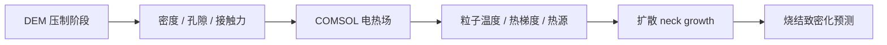

# 06 Liu Sintering Coupling

## 阶段目的

复现 Liu 论文中的压制-烧结耦合。当前已有压力-密度拟合和热-烧结代理指标；
本阶段要把 COMSOL 温度场接入烧结 neck growth 和致密化模型。

## 当前基础

已有：

- Heckel、Kawakita、Huang 压实曲线拟合。
- 接触力到电导、电流、Joule heat 的代理映射。
- 粒子温度代理场。
- neck growth proxy。
- force-current 和 heat-neck 正相关检查。

不足：

- 还没有真实温度场。
- 还没有材料扩散常数、活化能、烧结时间标定。
- 还没有把压制残余应力、孔隙和温度场统一传递到烧结模型。

## 输入

| 输入 | 来源 |
|---|---|
| 压力-密度曲线 | DEM workflow |
| 接触网络和接触力 | DEM workflow |
| COMSOL 温度场 | 阶段 04 |
| 扩散参数 | 文献或材料数据库 |
| 烧结时间和边界条件 | 论文或用户设定 |

## 耦合逻辑

## 验收门槛

| 验收项 | 判定 |
|---|---|
| COMSOL 温度输出能导入 Python | 待完成 |
| 至少一种扩散机制能使用真实温度场计算 | 待完成 |
| neck growth 与温度/热源呈合理正相关 | 待完成 |
| 压制密度 milestones 能传入烧结模型 | 待完成 |

