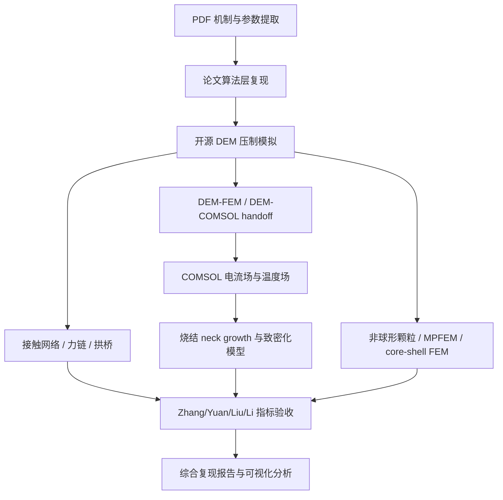

# 粉末压制多物理场论文复现目标

本文档树是后续工作的主入口。目标不是把四篇论文混在一起反复试，而是把
“粉末压制过程中应力分布影响颗粒接触，接触影响电流与温度场，最终影响合金
致密化”这一总目标拆成可检阅、可运行、可视化的阶段。

每个阶段都有自己的文件夹。阶段完成后的数据、图、workflow 证据、报告都应放
回对应阶段文件夹，便于查找、复查和继续分析。

可直接交给工程代理执行的完整任务合同见
[`00_project_control/full_reproduction_goal_prompt.md`](00_project_control/full_reproduction_goal_prompt.md)。

## 总目标

建立一条可复现的开源 DEM + COMSOL/FEM 多物理场路线：

1. 从四篇硕士论文提取可计算机制、参数、指标和验收条件。
2. 先用 Python 复现论文中的算法指标和趋势，形成 solver-neutral 数据合同。
3. 用 LIGGGHTS/LAMMPS/YADE 等开源 DEM 生成颗粒位置、接触状态、应力、力链和拱桥结构。
4. 用 COMSOL 求解电流场和温度场，并把温度结果接回烧结和致密化模型。
5. 用开源 FEM/MPFEM 替代 Abaqus、MSC.MARC 等商业有限元路线，形成可公开复现的平行方案。
6. 最终输出四篇论文的分阶段复现报告、数据表、图像和验收矩阵。

## 核心技术路线



## 文件夹索引

| 阶段 | 文件夹 | 状态 | 目的 |
|---|---|---|---|
| 00 | [00_project_control](00_project_control/README.md) | 进行中 | 总目标、边界、归档规则和验收纪律 |
| 01 | [01_pdf_algorithm_layer](01_pdf_algorithm_layer/README.md) | 已完成基础层 | PDF 机制映射和四篇论文算法层复现 |
| 02 | [02_dem_backend_light_demo](02_dem_backend_light_demo/README.md) | 已完成轻量层 | 开源 DEM 后端选择和 LIGGGHTS workflow demo |
| 03 | [03_zhang_particle_scale](03_zhang_particle_scale/README.md) | review | Zhang C/D/E 参数校准和 2x 粒子数升级 |
| 04 | [04_comsol_electrothermal_field](04_comsol_electrothermal_field/README.md) | smoke + 网格验证完成 | COMSOL 电流场、温度场、Joule heat 主线 |
| 05 | [05_yuan_shape_arch_bridge](05_yuan_shape_arch_bridge/README.md) | 待启动 | Yuan 非球形颗粒、拱桥结构和 MPFEM 路线 |
| 06 | [06_liu_sintering_coupling](06_liu_sintering_coupling/README.md) | 待启动 | Liu 压制-热场-烧结耦合 |
| 07 | [07_li_core_shell_fem](07_li_core_shell_fem/README.md) | 待启动 | Li Cu@Fe 包覆颗粒 core-shell FEM/MPFEM |
| 08 | [08_integrated_report_visualization](08_integrated_report_visualization/README.md) | 待启动 | 综合报告、图表、数据看板和最终验收 |

机器可读的阶段状态表见 [stage_status.csv](stage_status.csv)。

## 已经完成的关键证据

| 证据 | 当前状态 |
|---|---|
| PDF 机制映射 | 已建立，见 `docs/paper_pdf_reproduction_map.md` |
| 四篇论文算法层复现 | 已能由 `scripts/run_paper_algorithm_reproduction.py` 生成 |
| 开源 DEM 后端 | 当前选择 LIGGGHTS-PUBLIC，备选 LAMMPS/YADE/MercuryDPM/Chrono |
| 真实 DEM workflow | `dia60al40-dem.yml` 已能在 GitHub Actions 跑通 |
| DEM evidence gate | 已有 `87 pass / 0 missing / 0 mismatch` 轻量证据 |
| Zhang 尺寸分组 sweep | C/D/E 三段 size-specific sweep 均成功 |
| Zhang 2x 粒子数 demo | C `27875950305`、D `27875951506`、E `27875952754` 均成功并已导入阶段目录 |
| Zhang pscale=2 follow-up | C 已得到 `Emax=63.462 GPa, mu=0.654, P95=586.646 MPa` 的 pass 候选，D/E 仍为 review |
| Zhang C seed recheck | 5 个 seed 已成功运行并导入；C 只有 1/5 同时满足压力窗口和 trend gate，不稳健 |
| Zhang C pressure-lift recheck | Emax 单变量 5-seed run 已成功并导入；平均 P95 回到 574.211 MPa、CV 降至 0.0396，但只有 2/5 同时通过双门槛 |
| Zhang C 4x-settle recheck | 运行与参数溯源已通过；trend 提高到 5/5，但压力 CV 恶化 130.22%、仅 1/5 同时通过双门槛，故拒绝 4x dwell |
| Zhang C settle=2 midpoint | 五 seed 与 ensemble 已成功；trend 5/5，但压力窗口 0/5、CV=0.1268，故拒绝 scale 2 并停止 dwell 分支 |
| Zhang C 25 cm/s loading-rate recheck | 五 seed 与 ensemble 已成功；trend 5/5、双门槛 3/5，但 CV 增加 33.52%，故拒绝 |
| Zhang contact-model audit | 已核清论文阻尼 0.2 与 LIGGGHTS 恢复系数语义不同；已固定求解器提交并注册 sidewall-only 10-job 计划 |
| Zhang C sidewall-friction recheck | 固定求解器的 10-job 配对试验已导入；`mu_w=0.001` 使均值跌出窗口、CV 增加 41.71%，故拒绝 |
| Zhang C particle-friction recheck | 复用验证基线的 5-job test 已导入；平均 P95 降至 409.996 MPa、双门槛 0/5，故拒绝 |
| Zhang E pressure-lift plan | 已预注册 5-seed 单变量 Emax 计划：`87.368 → 96.417 GPa` |
| Zhang E pressure-lift result | 五 seed 已运行并导入；trend 4/5、双门槛 3/5，但均值 644.331 MPa，停止 Emax-only 分支 |
| D 组失败诊断 | 已确认旧 verifier 半径阈值误判，已修复 |
| COMSOL 电热 smoke | COMSOL 6.4 真实求解成功；与开源 FVM 的 Joule 功率差 1.202%、最大温升差 0.568%，九项门槛全通过；GitHub verifier run `28793218330` success |
| COMSOL 网格无关性 | 1512/3316/8390 三档真实求解通过；中/细网格 Joule 功率差 0.0277%、最大温升差 0.0187%，十项门槛全通过 |

## 仍未完成的边界

不能提前宣称完成的内容：

- Zhang 还没有论文级 3000 颗粒、600 MPa、力链图像一比一复现。
- Yuan 还没有真实非球形颗粒或 MPFEM 形状模型。
- Liu 已有 COMSOL 单阶段均匀化电流/温度场 smoke，但还没有材料参数标定、颗粒分辨接触和扩散/烧结闭环。
- Li 还没有 Cu@Fe core-shell 多颗粒 FEM/MPFEM 模型。
- 当前轻量 DEM 和温度/烧结代理模型只能证明路线可行，不能替代最终论文级复现。

## 阶段完成纪律

每个阶段进入下一阶段前，必须满足以下要求：

1. 目标明确：该阶段只解决一种主要风险。
2. 输入明确：PDF 参数、DEM artifact、COMSOL 文件或 FEM 输入必须写清。
3. 产物明确：CSV、图、报告、workflow run、模型文件要放入阶段目录。
4. 验收明确：通过、review、失败的判断标准提前写明。
5. 证据归档：网页成功不算最终证据，必须导入或记录到仓库文档。
6. 可视化可读：关键曲线、网络图、温度图、阶段对比表都要有固定位置。

建议每个阶段使用以下结构：

```text
stage_folder/
  README.md        # 阶段目标、方法、验收条件
  data/            # CSV、JSON、导入后的 artifact 摘要
  figures/         # 压力曲线、温度场、网络图、对比图
  evidence/        # workflow run、日志摘要、外部工具输出说明
  report.md        # 阶段完成后的判读报告
```

## 当前下一步

COMSOL 单阶段电热 smoke 已完成：stage5 的 157 条 LIGGGHTS 直接接触被映射为
空间电导率/热导率，COMSOL 6.4 和开源 FVM 均得到非空电势、电流、Joule heat
和温度场，九项交叉门槛全部通过。该结果只证明软件与数据路线，不是实验标定。

三档 COMSOL 网格验证已经完成，原 3316 单元网格对 Joule 功率和最大温升已收敛。
下一小目标进入参数可信度升级：为 Al、diamond 和接触电阻补充论文/材料来源，
完成参数与加载敏感性，再把粒子/空间温度输出接入阶段 06 的 Liu 烧结颈增长与
致密化指标。Zhang 阶段继续保持 `review`，不恢复已被证据否决的单变量扫描。
